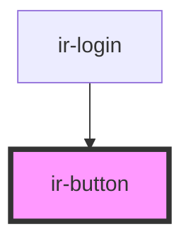

# ir-button

<!-- Auto Generated Below -->

## Properties

| Property       | Attribute       | Description | Type                                                                                            | Default     |
| -------------- | --------------- | ----------- | ----------------------------------------------------------------------------------------------- | ----------- |
| `buttonStyle`  | `button-style`  |             | `string`                                                                                        | `''`        |
| `buttonTitle`  | `button-title`  |             | `string`                                                                                        | `''`        |
| `colorVariant` | `color-variant` |             | `"danger" \| "dark" \| "info" \| "light" \| "primary" \| "secondary" \| "success" \| "warning"` | `'primary'` |
| `glow`         | `glow`          |             | `boolean`                                                                                       | `undefined` |
| `icon`         | `icon`          |             | `string`                                                                                        | `''`        |
| `shadow`       | `shadow`        |             | `"" \| "1" \| "2" \| "3" \| "4" \| "5"`                                                         | `''`        |
| `shapeVariant` | `shape-variant` |             | `"default" \| "outline" \| "round" \| "square"`                                                 | `'default'` |
| `type`         | `type`          |             | `"button" \| "reset" \| "submit"`                                                               | `'button'`  |

## Events

| Event           | Description | Type               |
| --------------- | ----------- | ------------------ |
| `buttonClicked` |             | `CustomEvent<any>` |

## Dependencies

### Used by

 - [ir-login](../ir-login)

### Graph

----------------------------------------------

*Built with [StencilJS](https://stenciljs.com/)*
