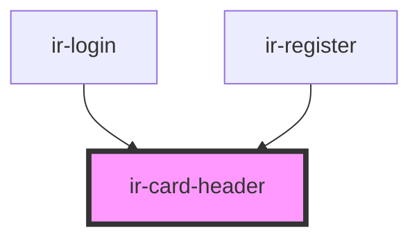

# ir-card-header

<!-- Auto Generated Below -->

## Properties

| Property       | Attribute        | Description | Type     | Default     |
| -------------- | ---------------- | ----------- | -------- | ----------- |
| `headerTitle`  | `header-title`   |             | `string` | `undefined` |
| `imageAltText` | `image-alt-text` |             | `string` | `undefined` |
| `imageSource`  | `image-source`   |             | `string` | `undefined` |

## Dependencies

### Used by

 - [ir-login](../ir-login)
 - [ir-register](../ir-register)

### Graph

----------------------------------------------

*Built with [StencilJS](https://stenciljs.com/)*
