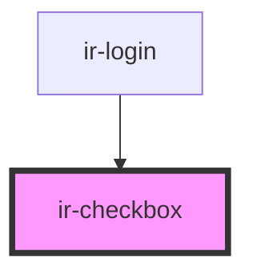

# ir-checkbox

<!-- Auto Generated Below -->

## Properties

| Property         | Attribute         | Description | Type      | Default     |
| ---------------- | ----------------- | ----------- | --------- | ----------- |
| `checkboxStyle`  | `checkbox-style`  |             | `string`  | `undefined` |
| `checked`        | `checked`         |             | `boolean` | `undefined` |
| `containerStyle` | `container-style` |             | `string`  | `undefined` |
| `disabled`       | `disabled`        |             | `boolean` | `undefined` |
| `inputId`        | `input-id`        |             | `string`  | `''`        |
| `label`          | `label`           |             | `string`  | `''`        |
| `labelStyle`     | `label-style`     |             | `string`  | `undefined` |

## Events

| Event           | Description | Type                   |
| --------------- | ----------- | ---------------------- |
| `oncheckchange` |             | `CustomEvent<boolean>` |

## Dependencies

### Used by

 - [ir-login](../ir-login)

### Graph

----------------------------------------------

*Built with [StencilJS](https://stenciljs.com/)*
