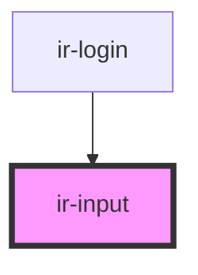

# ir-input

<!-- Auto Generated Below -->

## Properties

| Property         | Attribute         | Description | Type      | Default     |
| ---------------- | ----------------- | ----------- | --------- | ----------- |
| `containerStyle` | `container-style` |             | `string`  | `undefined` |
| `icon`           | `icon`            |             | `string`  | `undefined` |
| `inputId`        | `input-id`        |             | `string`  | `undefined` |
| `label`          | `label`           |             | `string`  | `undefined` |
| `placeholder`    | `placeholder`     |             | `string`  | `undefined` |
| `required`       | `required`        |             | `boolean` | `undefined` |
| `type`           | `type`            |             | `string`  | `undefined` |
| `value`          | `value`           |             | `string`  | `undefined` |

## Events

| Event          | Description | Type                  |
| -------------- | ----------- | --------------------- |
| `ontextchange` |             | `CustomEvent<string>` |

## Dependencies

### Used by

 - [ir-login](../ir-login)

### Graph

----------------------------------------------

*Built with [StencilJS](https://stenciljs.com/)*
