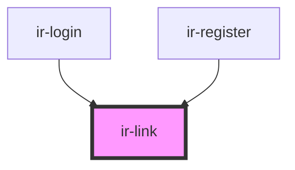

# ir-link

<!-- Auto Generated Below -->

## Properties

| Property          | Attribute          | Description | Type     | Default     |
| ----------------- | ------------------ | ----------- | -------- | ----------- |
| `linkDestination` | `link-destination` |             | `string` | `undefined` |
| `linkTitle`       | `link-title`       |             | `string` | `undefined` |

## Dependencies

### Used by

 - [ir-login](../ir-login)
 - [ir-register](../ir-register)

### Graph

----------------------------------------------

*Built with [StencilJS](https://stenciljs.com/)*
