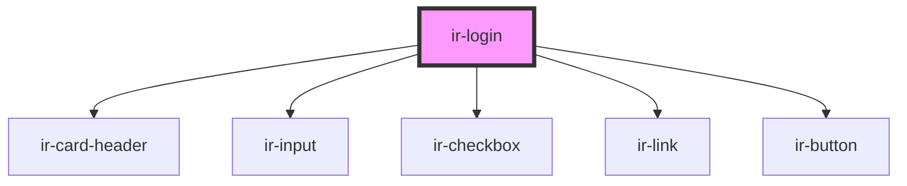

# ir-login

<!-- Auto Generated Below -->

## Events

| Event          | Description | Type                  |
| -------------- | ----------- | --------------------- |
| `loginClicked` |             | `CustomEvent<ILogin>` |

## Dependencies

### Depends on

- [ir-card-header](../ir-card-header)
- [ir-input](../ir-input)
- [ir-checkbox](../ir-checkbox)
- [ir-link](../ir-link)
- [ir-button](../ir-button)

### Graph

----------------------------------------------

*Built with [StencilJS](https://stenciljs.com/)*
