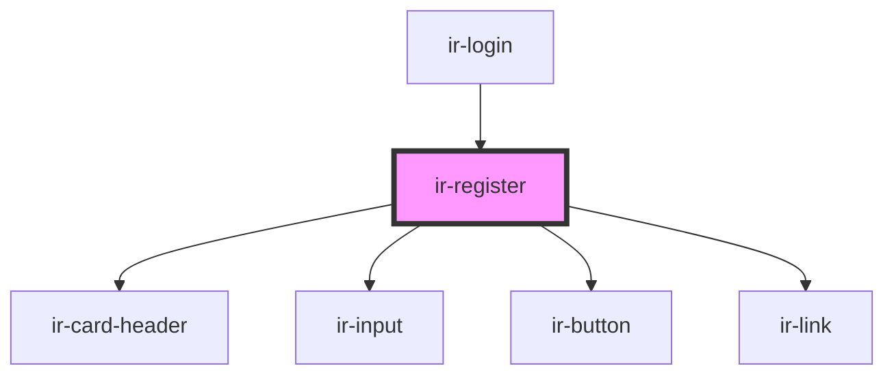

# ir-register

<!-- Auto Generated Below -->

## Events

| Event              | Description | Type                     |
| ------------------ | ----------- | ------------------------ |
| `linkLoginClicked` |             | `CustomEvent<any>`       |
| `registerClicked`  |             | `CustomEvent<IRegister>` |

## Dependencies

### Used by

 - [ir-login](../ir-login)

### Depends on

- [ir-card-header](../ir-card-header)
- [ir-input](../ir-input)
- [ir-button](../ir-button)
- [ir-link](../ir-link)

### Graph

----------------------------------------------

*Built with [StencilJS](https://stenciljs.com/)*
